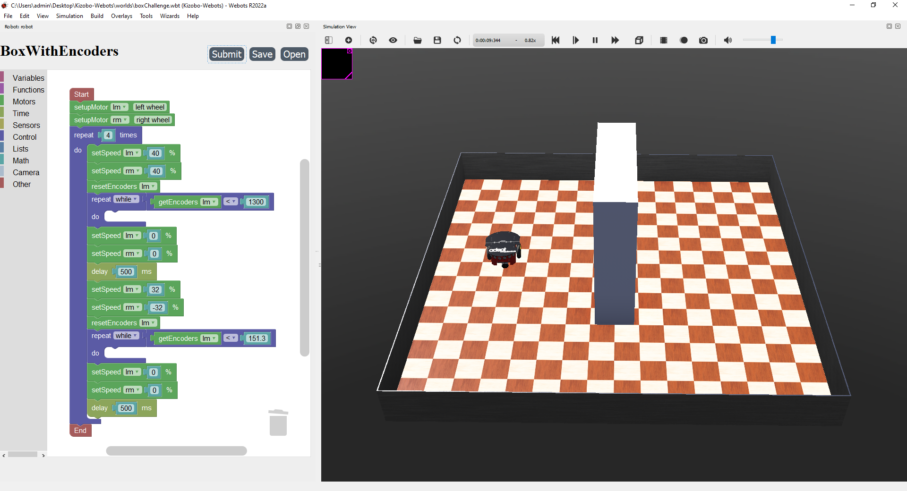

Kizobo-Webots is an extension for the Webots simulation platform that allows for drag-and-drop programming using Google's Blockly library.

Requirement:
- Windows 10/11
- Webots 2022a: https://github.com/cyberbotics/webots/releases/download/R2022a/webots-R2022a_setup.exe
- Python 3.9: https://apps.microsoft.com/detail/9p7qfqmjrfp7?hl=en-US&gl=US

